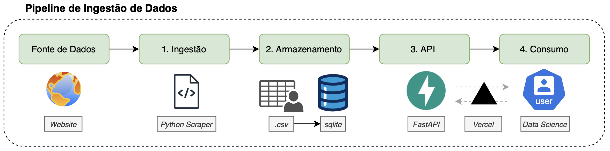

# Tech Challenge: API de Consulta de Livros

## Descrição 

O objetivo desse projeto é fornecer uma API RESTful pública, robusta e escalável, que servirá como base para futuras aplicações, como sistemas de recomendação de livros.

Os dados são extraídos através de um script de web scraping do site [books.toscrape.com](http://books.toscrape.com/) e servidos através de uma API com FastAPI.

> **API Pública para Testes:** Uma versão desta API está disponível para testes e demonstração no seguinte endereço (Swagger UI): 
> **https://fiap-ml-tech-challenge-1-nine.vercel.app/docs**

## Arquitetura

O fluxo de dados do projeto foi desenhado para ser simples, modular e eficaz, seguindo quatro etapas distintas:



O sistema é dividido em três componentes principais que garantem a modularização e a manutenibilidade do projeto.

1.  **Web Scraper (`scripts/scraper.py`):**
    * **Função:** Navega pelo site `books.toscrape.com`, extrai os detalhes de todos os livros e salva os dados brutos em um arquivo `data/books.csv`.

2.  **Banco de Dados (ETL na Inicialização):**
    * **Função:** Ao iniciar a API, um processo automatizado (`app/database.py`) é acionado. Ele verifica se o banco de dados `data/data.db` está vazio e, em caso afirmativo, lê os dados do `books.csv` e os insere na tabela `books`. 

3.  **API RESTful (`app/`):**
    * **Função:** Expõe os dados armazenados no banco de dados através de uma série de endpoints RESTful.

### Estrutura de Diretórios

A estrutura foi organizada em módulos para separar as responsabilidades da API geral das de Machine Learning.

```
.
├── app/                  # Contém toda a lógica da API FastAPI
│   ├── database.py       # Configuração do DB e lógica de consumo de dados
│   ├── main.py           # Ponto de entrada da API
│   ├── models.py         # Modelos da tabela de negócio (books)
│   ├── routes.py         # Endpoints de negócio
│   ├── schemas.py        # Schemas de validação de negócio
│   ├── services.py       # Lógica de negócio (consultas ao DB)
│   └── ml/               # Módulo dedicado para Machine Learning
│       ├── ml_models.py
│       ├── ml_routes.py
│       ├── ml_schemas.py
│       └── ml_services.py
├── data/                 # Armazena os dados
│   ├── books.csv         # Dados brutos do scraper
│   └── data.db           # Banco de dados SQLite
├── scripts/              # Scripts auxiliares
│   └── scraper.py        # Script de web scraping
└── requirements.txt      # Dependências do projeto
```

---

## Instalação e Configuração

Siga os passos abaixo para configurar o ambiente de desenvolvimento local.

**Pré-requisitos:**
* Python 3.9 ou superior
* pip

**Passos:**

1.  **Clone o repositório:**
    ```bash
    git clone <https://github.com/michelhilg/fiap-ml-tech-challenge-1.git>
    cd <fiap-ml-tech-challenge-1>
    ```

2.  **Crie e ative um ambiente virtual:**
    ```bash
    # Cria o ambiente
    python -m venv venv

    # Ativa o ambiente (Linux/macOS)
    source venv/bin/activate

    # Ativa o ambiente (Windows)
    .\venv\Scripts\activate
    ```

3.  **Instale as dependências:**
    ```bash
    pip install -r requirements.txt
    ```

---

## Instruções para Execução

**1. Execute o Web Scraper:**
Primeiro, execute o scraper para coletar os dados e criar o arquivo `data/books.csv`.

```bash
python scripts/scraper.py
```

**2. Inicie a API:**
Com o arquivo `books.csv` criado, inicie o servidor da API. Na primeira execução, ele irá criar e popular o banco de dados `data.db` automaticamente.

```bash
uvicorn app.main:app --reload
```

O servidor estará disponível em `http://127.0.0.1:8000`.

---

### Documentação das Rotas da API

A API gera documentação interativa automaticamente. Com o servidor rodando, acesse:
* **Swagger UI:** `http://127.0.0.1:8000/docs`
* **ReDoc:** `http://127.0.0.1:8000/redoc`

---

### Endpoints de Autenticação

Para acessar as rotas protegidas (rotas de ML), primeiro obtenha um token de acesso.

#### Realizar Login
* **Endpoint:** `POST /api/v1/login`
* **Descrição:** Autentica o usuário e retorna um token de acesso JWT.
* **Credenciais:**
    * `username`: `admin`
    * `password`: `admin123`
* **Exemplo de Resposta (Sucesso):**
    ```json
    {
      "access_token": "eyJhbGciOiJIUzI1NiIsInR5cCI6IkpXVCJ9...",
      "token_type": "bearer"
    }
    ```

### Endpoints de Negócio

#### Health Check

Verifica o status da API e a conexão com o banco de dados.

* **Endpoint:** `GET /api/v1/health`
* **Exemplo de Resposta (Sucesso):**
    ```json
    {
      "api_status": "ok",
      "database_status": "ok"
    }
    ```

#### Listar Todos os Livros

Retorna a lista completa de livros disponíveis.

* **Endpoint:** `GET /api/v1/books`
* **Exemplo de Resposta (Sucesso):**
    ```json
    [
      {
        "id": 1,
        "title": "A Light in the Attic",
        "price": 51.77,
        "rating": "Three",
        "availability": "In stock (22 available)",
        "category": "Poetry",
        "image_url": "[http://books.toscrape.com/media/cache/2c/da/2cdad67c44b002e7ead0cc35693c0e8b.jpg](http://books.toscrape.com/media/cache/2c/da/2cdad67c44b002e7ead0cc35693c0e8b.jpg)"
      }
    ]
    ```

#### Buscar Livro por ID

Retorna os detalhes de um livro específico.

* **Endpoint:** `GET /api/v1/books/{book_id}`
* **Exemplo de Chamada:** `http://127.0.0.1:8000/api/v1/books/10`
* **Exemplo de Resposta (Sucesso):**
    ```json
    {
      "id": 11,
      "title": "Starving Hearts (Triangular Trade Trilogy, #1)",
      "price": 13.99,
      "rating": "Two",
      "availability": "In stock (19 available)",
      "category": "Default",
      "image_url": "[http://books.toscrape.com/media/cache/60/0b/600b3b22f7db9167515d4d77a22c9853.jpg](http://books.toscrape.com/media/cache/60/0b/600b3b22f7db9167515d4d77a22c9853.jpg)"
    }
    ```
* **Exemplo de Resposta (Erro 404):**
    ```json
    {
      "detail": "Livro com ID 9999 não encontrado."
    }
    ```

#### Buscar Livros por Título e/ou Categoria

Busca livros com base em filtros.

* **Endpoint:** `GET /api/v1/books/search`
* **Parâmetros (Query):**
    * `title` (opcional): Parte do título do livro.
    * `category` (opcional): Nome exato da categoria.
* **Exemplo de Chamada:** `http://127.0.0.1:8000/api/v1/books/search?title=secret&category=Mystery`
* **Exemplo de Resposta (Sucesso):**
    ```json
    [
      {
        "id": 588,
        "title": "The Secret Garden",
        "price": 15.08,
        "rating": "Four",
        "availability": "In stock (15 available)",
        "category": "Classics",
        "image_url": "[http://books.toscrape.com/media/cache/98/d6/98d62641f92984443999631c1c11aee4.jpg](http://books.toscrape.com/media/cache/98/d6/98d62641f92984443999631c1c11aee4.jpg)"
      }
    ]
    ```

#### Listar Todas as Categorias

Retorna uma lista de todas as categorias únicas de livros.

* **Endpoint:** `GET /api/v1/categories`
* **Exemplo de Resposta (Sucesso):**
    ```json
    {
      "categories": [
        "Travel",
        "Mystery",
        "Historical Fiction",
        "Sequential Art",
        "Classics",
        "..."
      ]
    }

---

### Endpoints de Machine Learning

Estes endpoints foram criados para facilitar o ciclo de vida de modelos de ML.

**Atenção:** Todos os endpoints nesta seção requerem autenticação. Você deve primeiro obter um token através do endpoint `/login` e incluí-lo no header `Authorization` como `Bearer <seu_token>`.

#### Processar e Salvar Features
* **Endpoint:** `GET /api/v1/ml/features`
* **Descrição:** Este endpoint lê os dados brutos da tabela `books`, realiza uma engenharia de features básica (convertendo `rating` e `availability` para formato numérico) e salva o resultado na tabela `ml_data`. Ele retorna os dados que foram salvos.
* **Exemplo de Resposta (Sucesso):**
    ```json
    [
      {
        "id": 1,
        "book_id": 1,
        "price": 51.77,
        "rating_numeric": 3,
        "availability_numeric": 22,
        "category": "Poetry"
      }
    ]
    ```

#### Obter Dataset de Treinamento
* **Endpoint:** `GET /api/v1/ml/training-data`
* **Descrição:** Lê os dados da tabela `ml_data` (criada pelo endpoint `/features`) e retorna o dataset final, pronto para ser usado no treinamento de um modelo.
* **Exemplo de Resposta (Sucesso):**
    ```json
    {
      "training_dataset": [
        {
          "id": 1,
          "book_id": 1,
          "price": 51.77,
          "rating_numeric": 3,
          "availability_numeric": 22,
          "category": "Poetry"
        }
      ]
    }
    ```

#### Realizar Predições (Simulação)
* **Endpoint:** `POST /api/v1/ml/predictions`
* **Descrição:** Este é um endpoint de **simulação** que demonstra como um modelo de ML poderia ser servido. Ele recebe dados de um livro e retorna uma predição de rating baseada em uma lógica simples, sem o uso de um modelo real treinado.
* **Exemplo de Requisição (Corpo):**
    ```json
    {
      "price": 45.99,
      "category": "Mystery",
      "availability_numeric": 15
    }
    ```
* **Exemplo de Resposta (Sucesso):**
    ```json
    {
      "predicted_rating": "Four",
      "confidence_score": 0.88
    }

---

## Sistema de Web Scraping

O projeto inclui um script de web scraping robusto e automatizado, desenvolvido em Python, com o objetivo de extrair dados do site de e-commerce de livros [https://books.toscrape.com/](https://books.toscrape.com/).

O scraper foi construído para navegar por todas as páginas do site. Os dados extraídos incluem: 

* Título
* Preço
* Rating (classificação por estrelas) 
* Disponibilidade
* Categoria
* URL da imagem da capa

### O que esperar após a execução

Ao rodar o script, você verá os **logs do processo sendo exibidos em tempo real no seu terminal**. As mensagens informarão o progresso, como a página atual que está sendo raspada e o resumo final.

Além disso, o script produzirá o seguinte resultado:

* **Arquivo de Dados:** Será criada uma pasta `data/` na raiz do projeto e dentro dela o arquivo `books.csv`. Este arquivo conterá todos os dados dos livros extraídos e será sobrescrito a cada nova execução para garantir que os dados estejam sempre atualizados.
